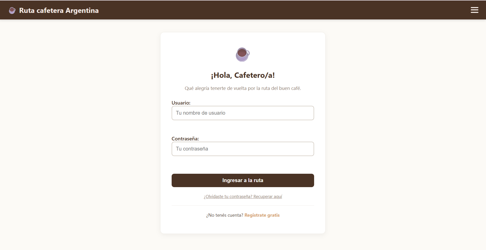
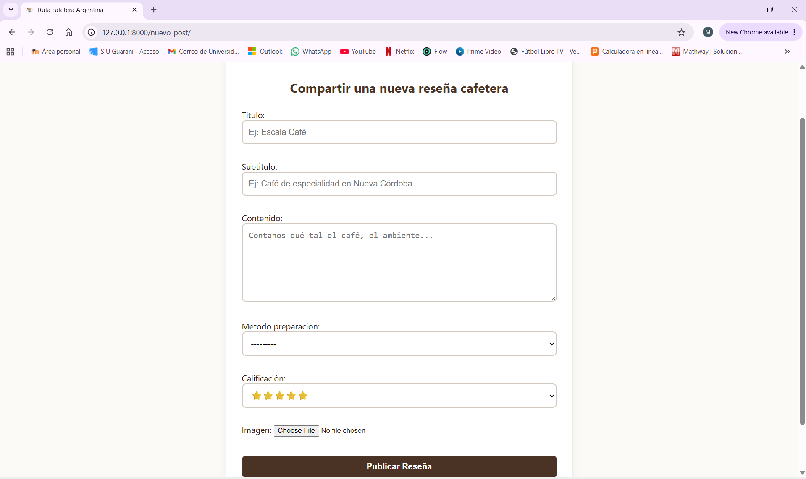

# Trabajo-final_Coder89385_Sardi-Rivera-Martina
# MI APP: ☕ Ruta cafetera Argentina

Un espacio diseñado para la comunidad de amantes del café de especialidad en Argentina. Los usuarios pueden explorar reseñas de cafeterías, filtrarlas por métodos de preparación, puntuar sus experiencias con estrellas, comentar publicaciones y gestionar un perfil personalizado con su propio perfil.

## Aplicación Desplegada en Vivo
El proyecto se encuentra activo y accesible públicamente a través del siguiente enlace:
👉 **[https://ruta-cafetera-argentina.onrender.com](https://onrender.cohttps://ruta-cafetera-argentina.onrender.comm)**

## Credenciales de Acceso para la Evaluación (Demo de Prueba)
Para probar los flujos interactivos de autenticación, CRUD y comentarios sin necesidad de registrarse, puede utilizar el siguiente usuario de pruebas:
*   **Usuario:** `tester_cafe`
*   **Contraseña:** `password123`

# Vista del Producto (Flujo de la Aplicación)
A continuación se detalla el recorrido visual de la plataforma paso a paso para facilitar la evaluación del producto final sin depender de la URL en línea:

### 1. Inicio / Landing Page
*Vista de la página principal donde se cargan las últimas reseñas de café de especialidad publicadas por la comunidad.*


### 2. Autenticación de Usuarios
*Formulario de ingreso para usuarios registrados. Permite habilitar los permisos de escritura para crear posts y comentar.*


### 3. Formulario de Creación de Reseñas (CRUD)
*Panel de interfaz exclusiva para usuarios donde se completan los campos de título, descripción, selección de estrellas y método de preparación.*


### 4. Detalle del Registro y Comentarios
*Vista ampliada de una cafetería específica donde se despliega la información completa, la puntuación del autor y la sección interactiva de comentarios.*


## 🎥 Video de demostración
Instalación, navegación y flujo completo de la aplicación en funcionamiento:
 **[[Hacé clic acá para ver el video de la aplicación](https://1drv.ms/v/c/e4823c21059fec3c/IQCSou-esplcR659m75bVE9BAQXTnPl7UK6zY_BasG4cf0A?e=eplxAj)]**
 LINK DEL VIDEO: https://1drv.ms/v/c/e4823c21059fec3c/IQCSou-esplcR659m75bVE9BAQXTnPl7UK6zY_BasG4cf0A?e=eplxAj

## Criterios de Aceptación Cumplidos (Para el Evaluador)
A continuación se detallan las funcionalidades principales implementadas y validadas en esta entrega final:

*   **CRUD Completo de Reseñas:** La aplicación permite listar las cafeterías en la página de inicio, ver la información extendida en una vista única y crear nuevas publicaciones a través de un formulario interactivo. *(Evidencia: Ver Capturas "Home", "crear_post", "hacer_comentarios")*.
*   **Persistencia y Relaciones en Base de Datos:** Los posts se vinculan de forma obligatoria con un Usuario (Autor) y opcionalmente con un Método de Preparación (V60, Prensa Francesa, etc.). Los cambios e inserciones se guardan de forma permanente en la base de datos. *(Evidencia: Ver Captura "crear_post" y Modelo Post en blog/models.py)*.
*   **Autenticación y Restricción de Accesos:** El sistema valida las credenciales de ingreso. Solo los usuarios que hayan iniciado sesión de forma exitosa tienen permitido comentar publicaciones o acceder al formulario para crear nuevas reseñas de café. *(Evidencia: Ver Captura "login")*.
*   **Validación de Formularios:** No se permite guardar una reseña si faltan los campos obligatorios como el título o el contenido principal; el sistema de Django frena el envío y muestra los mensajes de error correspondientes en el formulario.
*   **Sistema de Interacción (Comentarios y Calificaciones):** Los usuarios pueden puntuar la experiencia seleccionando un rango de estrellas (1 a 5) y dejar comentarios de texto que se renderizan y listan cronológicamente abajo de cada post. *(Evidencia: Ver Capturas "crear_post" y "hacer_comentarios")*.

## Orden de Prueba (Uso local)
Para ejecutar este proyecto en tu computadora, seguí estos pasos en tu terminal:
1. **Clonar el repositorio:**
   ```bash
   git clone https://github.com
   cd Trabajo-final_Coder89385_Sardi-Rivera-Martina
   ```

2. **Configurar el entorno y las claves:**
   * Crear y activar el entorno virtual:
     * **En Windows:**
       ```bash
       python -m venv venv
       .\venv\Scripts\activate
     ```
     * **En Mac/Linux:**
       ```bash
       python3 -m venv venv
       source venv/bin/activate
       ```
   * Crear un archivo `.env` en la raíz del proyecto y agregar las siguientes variables:
     ```env
     SECRET_KEY=tu_clave_secreta_aqui
     DEBUG=True
     ```

3. **Instalar dependencias obligatorias:**
   ```bash
   python.exe -m pip install -r requirements.txt
   ```

4. **Ejecutar las migraciones de la base de datos:**
   ```bash
   python manage.py migrate
   ```
5. **Crear usuario Administrador:**
   Para acceder al panel administrativo de Django (`/admin`) y gestionar los métodos de café, ejecute el siguiente comando:
   ```bash
      python manage.py createsuperuser
   ```
6. Iniciar el servidor local:
   ```bash
   python manage.py runserver
   ```
   *Ingresá en tu navegador a: `http://127.0.0.1:8000/`*

## Pruebas Automatizadas
Para validar el correcto funcionamiento y la lógica de creación de posts de café, ejecute:
```bash
python manage.py test
```

Desarrollado por Martina Sardi - Curso de Python en Coderhouse.
